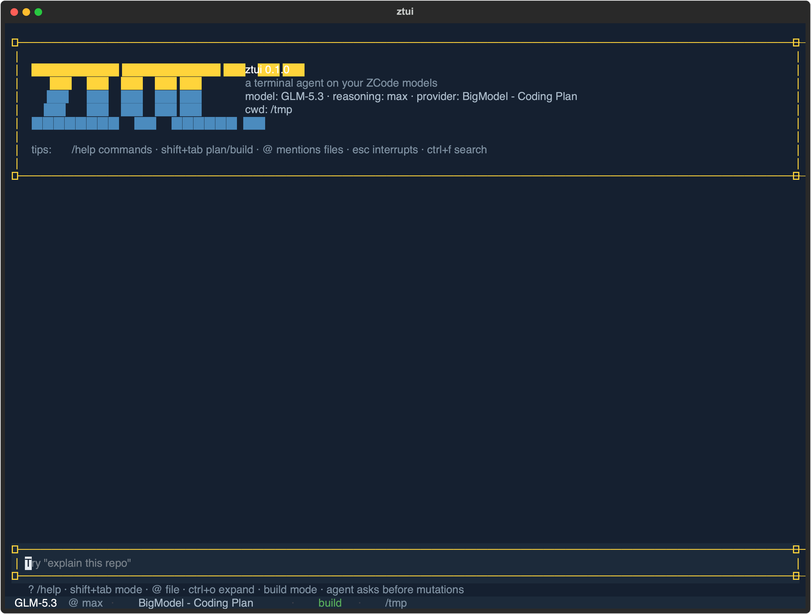
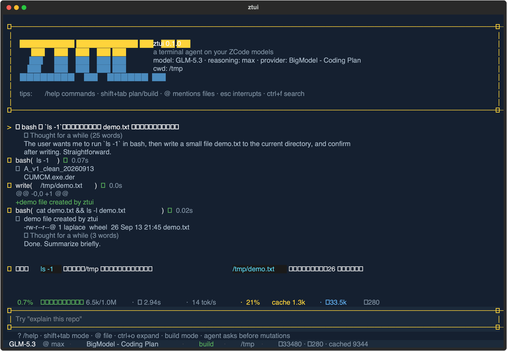
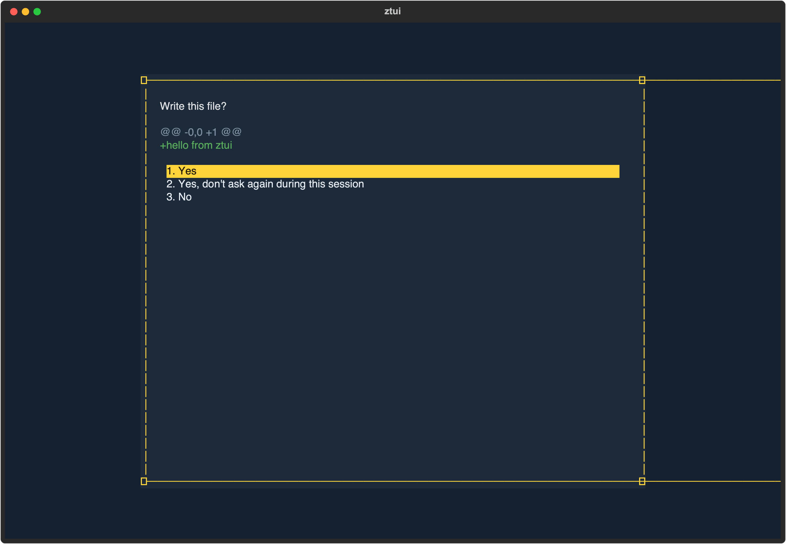
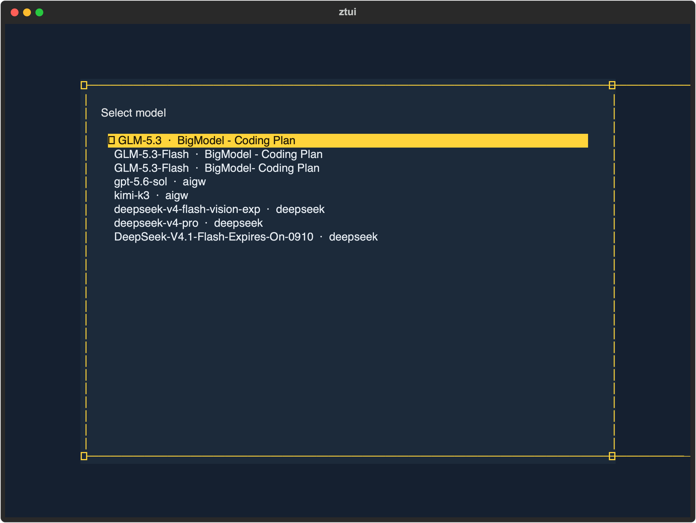
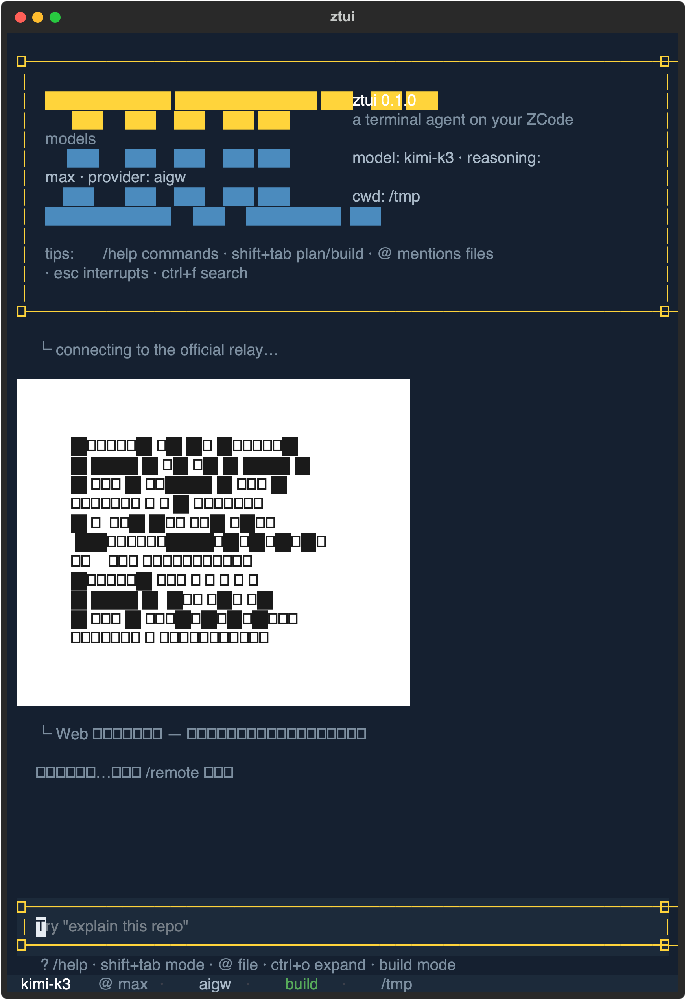
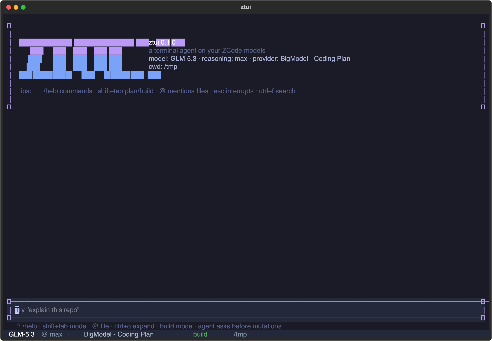
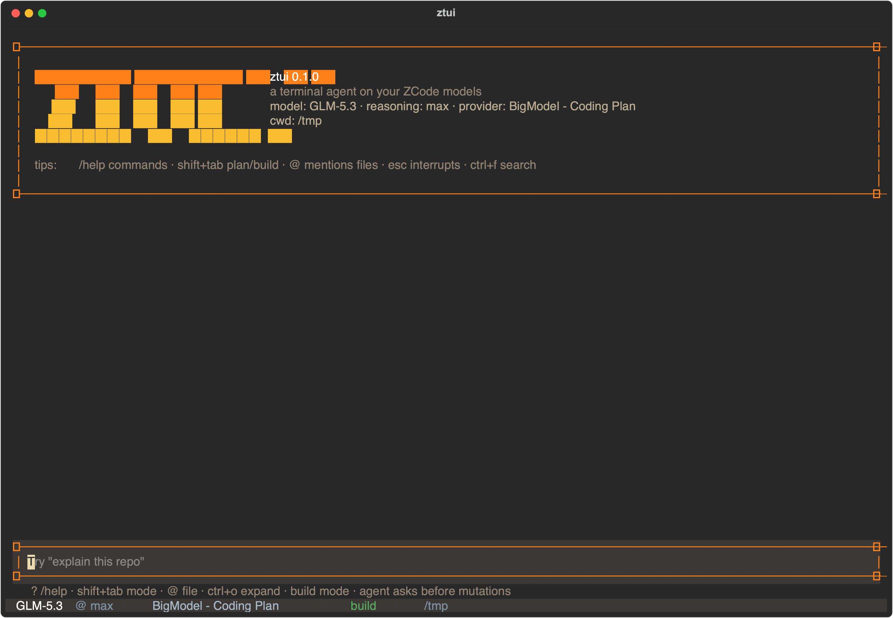

# ztui

**跑在你 ZCode 模型配置上的终端 Agent** —— Claude Code / OpenCode 风格的 TUI，纯 Python + Textual。
零额外 API key：直接复用 ZCode 客户端里配置好的 provider、模型与思考档位；对 ZCode 的本地数据**只读不写**。

<p align="center">
  
</p>

<p align="center">
  
</p>

## 为什么是 ztui

ZCode 桌面端很好用，但有时你就是想在终端里把活干完。ztui 把同一套能力搬进终端：

- **双协议全兼容**：`anthropic` + `openai-compatible`，zcode 里配的 9 个 provider（GLM-5.3、GLM-5.3-Flash、Kimi-K3、DeepSeek、OpenRouter…）开箱即用
- **思考档位同源**：low / high / max 直接翻译自 zcode 的模型目录（catalog），默认档也和 zcode 一致
- **语义对齐而非重新发明**：todo、undo、压缩、队列、`!` shell、`@` 提及、skills、goals……逐项对照 zcode/CC 行为实现
- **只读互操作**：续聊 zcode GUI 历史会话（`/sessions`）、定时任务面板（`/automations`）、checkpoints 漂移分析（`/checkpoints`）、workflow 巡检与执行（`/workflow` `/workflow-run`）、memory 面板（`/memory`）、git worktree（`/worktree`）、会话轨迹（`/trajectory`）——绝不写 zcode 的任何文件

## 快速开始

```bash
git clone https://github.com/LaplaceYoung/zcode-tui
cd zcode-tui
python3 -m venv .venv && .venv/bin/pip install -e .

# 可选：注册全局命令（~/.local/bin 已在 PATH 时）
ln -sf "$PWD/.venv/bin/ztui" ~/.local/bin/ztui

ztui                      # 启动 TUI
ztui -p "总结当前目录"     # 打印模式（可脚本化）
ztui --model kimi-k3      # 临时换模型
ztui --resume             # 接管既有会话
```

## 界面一览

<p align="center">
  
</p>

一条真实任务的全过程：`>` 用户指令 → `✻ Thinking`（可折叠）→ `⏺ bash` / `⏺ write` 工具块（✔ 状态 + 耗时 + 折叠输出 + diff）→ 助手总结。底部一行是**指标条**：上下文进度（绿/黄/红）、首字延迟 TTFT、生成速度 tok/s、缓存命中、累计用量。

### 交互（对照 Claude Code / OpenCode）

| 手势 | 行为 |
|---|---|
| `Esc` | 打断当前回合（同时丢弃排队消息） |
| `Shift+Tab` | plan ⇄ build 模式（yolo 用 `/mode`） |
| `↑ / ↓` | 输入历史召回（带草稿恢复） |
| `Ctrl+F` → `/search` | 会话内搜索，`Ctrl+N / Ctrl+P` 循环跳转 |
| `Ctrl+O` | 展开最近工具输出 |
| `Ctrl+V` | 剪贴板图片 → 📎 附件（随下条消息发送） |
| `Ctrl+X` `Ctrl+K` | 停止所有子代理与当前回合 |
| `End` | 回到底部、恢复自动跟随 |
| `Ctrl+C`×2 | 退出 |

忙时继续输入会**自动排队**（消息标 `queued`），回合结束依序执行——与 CC 的 queue 行为一致。`!cmd` 前缀直接跑 shell，输出注入对话上下文。

### 权限与安全网

build 模式下任何可变更操作都会弹出审批（完整命令 / diff 预览）：

<p align="center">
  
</p>

`1 Yes` · `2 Yes, don't ask again`（规则持久化）· `3 No`。plan 模式直接拒绝变更；`rm / sudo / 触碰 ~/.zcode` 在任何模式下都强制人工审批。

## 模型

`/model`：provider → 模型 → 思考档位（reasoning level）三段选择；档位翻译自 ZCode 的模型目录（catalog），双协议各自应用对应的请求补丁。

<p align="center">
  
</p>

## 手机远程接管

`/remote`：注册设备 → 输出**白卡二维码**（与 ZCode GUI 的 web-remote-control 同协议同页面），手机扫码即可远程查看会话流、审批权限、发送消息。

<p align="center">
  
</p>

## 主题

`/theme` 五套预置，即时切换 + 持久化；`/glyphs` 切换 safe（全字体兼容）/ fancy（Nerd Font 风）字形集。

| tokyo-night | gruvbox |
|---|---|
|  |  |

## 命令

| 命令 | 作用 |
|---|---|
| `/help` | 命令与键位总览 |
| `/model` `/mode` | 模型·档位 / plan-build-yolo |
| `/init` `/wiki` | 生成 AGENTS.md / 项目维基（docs/wiki/） |
| `/compact` `/undo` | 上下文摘要压缩 / 撤销上一回合（含文件回滚） |
| `/sessions` `/resume` `/new` | 会话恢复（含 ZCode GUI 历史会话只读续聊） |
| `/automations` `/checkpoints` `/workflow` `/workflow-run` | ZCode 定时任务 / checkpoints 漂移 / workflow 巡检与执行 |
| `/search` `/cost` `/export` `/goal` `/loop` | 搜索 / 成本 / 导出 / 目标 / 周期任务 |
| `/theme` `/glyphs` `/notify` `/bell` `/vim` `/thinking` | 外观与行为 |
| `/plugins` `/agents` | 插件市场 skills / 自定义 agent personas |
| `/exit` | 退出 |

之上还有 **33 个 zcode/user skills**（`/docx` `/replicate` `/record`…）与 `@文件` `@图片` 提及。

## 架构

```
zcode_tui/
├── zconfig.py        # ZCode 配置只读适配（provider/apiKey/档位/默认值）
├── reasoning.py      # 思考档位 → 请求体补丁（catalog 优先，内置兜底）
├── providers/        # anthropic + openai-compat 流式客户端（共享连接池）
├── agent/
│   ├── loop.py       # agent 主循环（流式→工具→审批→回注；子代理注册）
│   ├── context.py    # 系统提示：AGENTS.md 链 + memory + goal
│   ├── permission.py # plan/build/yolo + 规则集 + 危险命令兜底
│   ├── compaction.py # ~85% 上下文自动摘要（工具配对安全截断）
│   ├── session.py    # JSONL 会话存储（~/.local/share/zcode-tui/）
│   ├── skills.py     # zcode 插件 skills → slash 命令
│   ├── subagents.py  # ~/.zcode/agents personas
│   ├── pcommands.py  # 插件 commands → slash 命令
│   ├── zsessions.py / zautomations.py / zcheckpoints.py / zworkflows.py / zgit.py
│   └── tools/        # bash(后台) read write edit glob grep todo webfetch task
└── ui/               # Textual 界面（CC 视觉词汇 + 主题双集 + 远程/QR）
```

## 常见问题

- **要装 ZCode 吗？** 要（provider 与 apiKey 来自它的配置）；但运行 ztui 时 ZCode 无需启动。
- **会话存哪？** ztui 自己的 JSONL：`~/.local/share/zcode-tui/sessions/`；ZCode GUI 的历史在 sqlite 里只读查看。
- **中文出现方块？** 终端字体缺字形——`/glyphs` 切到 safe 集，或换用覆盖更全的字体（如更纱黑体、Sarasa Mono）。
- **改了 zcode 的文件吗？** 从不。所有互操作都是只读（sqlite `mode=ro`、清单解析），ztui 自身状态在 `~/.config/zcode-tui/` 与 `~/.local/share/zcode-tui/`。

## 边界（书面说明）

以下能力依赖 ZCode 私有运行时或云端，本项⽬不逆向实现（逐项查证见 `docs/coverage.md`）：会话分享链接、bots、workflow 的 CreateWorkflow 编译器（运行时已复用）、checkpoint 内容恢复（本地清单只含路径与大小）。

## License

MIT
